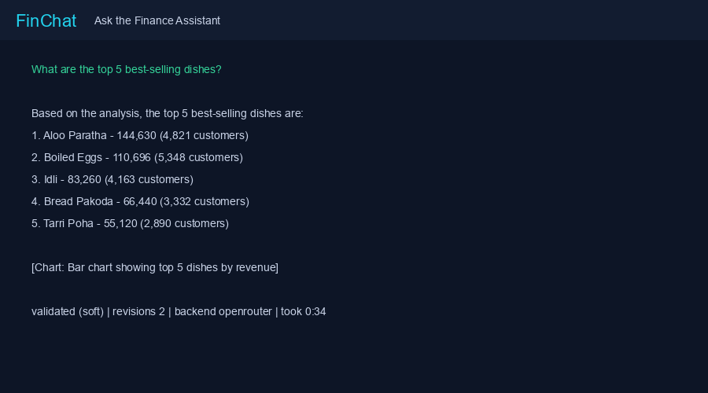
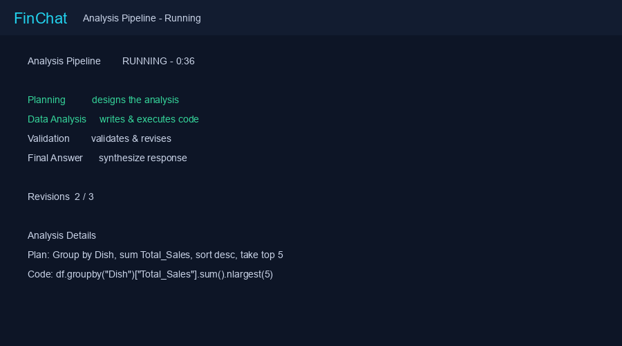
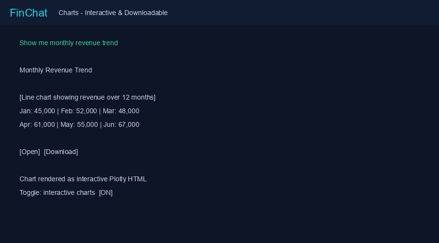
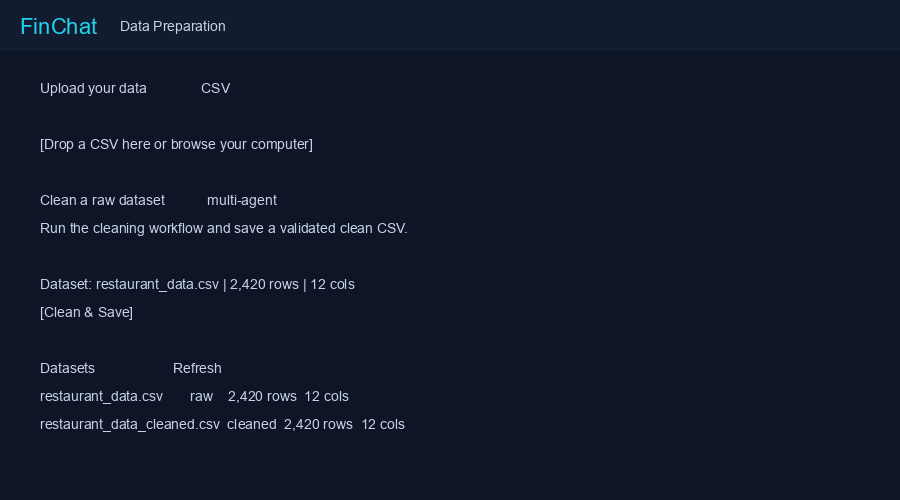
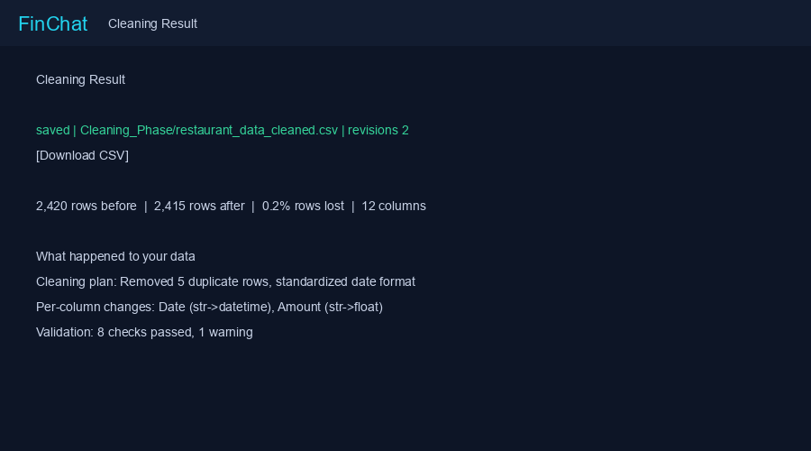

# FinChat — AI Finance Analytics

An intelligent multi-agent chatbot that answers natural-language questions about financial datasets, produces charts, and runs automated data-cleaning pipelines — all through a polished dark-theme web UI.

<p align="center">
  
</p>

---

## Authors

| Name | GitHub |
|------|--------|
| **Momen Aymen** | — |
| **Marwan Tamer** | [@MarwanTamerSayed](https://github.com/MarwanTamerSayed) |

---

## Key Features

| Feature | Description |
|---------|-------------|
| **Multi-Agent Analysis** | Planner → Coder → Critique → Synthesizer pipeline with automatic revision |
| **Data Cleaning** | Load & Profile → Plan → Code → Critique workflow with validation checks |
| **Interactive Charts** | Toggle between static matplotlib PNGs and hoverable Plotly HTML charts |
| **Chat Memory** | Remembers your last 5 questions per session for follow-up context |
| **CSV Upload** | Drag-and-drop upload with instant availability for analysis |
| **Two Backends** | OpenRouter (cloud) or local Ollama — switchable from the UI |
| **Real-Time Pipeline** | Watch each agent node execute live in the sidebar stepper |

---

## UI Snapshots

### Ask Assistant — Chat View
<p align="center">
  
</p>

*Ask questions in natural language and get validated answers with inline charts.*

### Analysis Pipeline — Live Progress
<p align="center">
  
</p>

*Watch the Planner → Coder → Critique → Synthesizer pipeline execute in real time.*

### Charts — Interactive & Downloadable
<p align="center">
  
</p>

*Charts render inline with open and download buttons. Toggle interactive Plotly charts above the send button.*

### Data Prep — Cleaning Workflow
<p align="center">
  
</p>

*Upload CSVs, run the multi-agent cleaning pipeline, and download validated clean files.*

### Cleaning Result — Validation Details
<p align="center">
  
</p>

*See before/after row counts, per-column changes, validation checks, and warnings.*

---

## Project Structure

```
Finance-Agent/
├── .gitignore
├── Analysis_Phase/
│   ├── multi_agent_analysis.py          # Local/Ollama analysis pipeline
│   └── multi_agent_analysis_openrouter.py  # OpenRouter analysis pipeline
├── Cleaning_Phase/
│   ├── multi_agent_cleaning.py          # Local cleaning pipeline
│   └── multi_agent_cleaning_openrouter.py  # OpenRouter cleaning pipeline
├── Handling_Data/                       # Raw dataset storage (gitignored)
├── webapp/
│   ├── run.py                           # One-command launcher
│   ├── requirements.txt
│   ├── backend/
│   │   └── main.py                      # FastAPI app + job system
│   └── frontend/
│       ├── index.html
│       ├── css/style.css
│       └── js/app.js
└── screenshots/                         # UI snapshots for README
```

---

## Getting Started

### Prerequisites

- **Python 3.11+** (conda environment recommended)
- **Ollama** (for local backend) — install from [ollama.ai](https://ollama.ai)
- **OpenRouter API key** (for cloud backend) — get one at [openrouter.ai](https://openrouter.ai)

### 1. Clone the Repository

```bash
git clone https://github.com/MarwanTamerSayed/Finance-Agent.git
cd Finance-Agent
```

### 2. Set Up Environment

```bash
# Create conda environment (or use your existing one)
conda create -n rag_env python=3.11
conda activate rag_env

# Install dependencies
cd webapp
pip install -r requirements.txt
```

### 3. Configure API Keys

Create a `.env` file in the project root:

```env
open_router_API=sk-or-v1-your-key-here
model=minimax/minimax-m3:free
```

### 4. Start the Server

```bash
python run.py
```

Open **http://127.0.0.1:8000** in your browser.

---

## Backend Options

| Backend | Model | Setup |
|---------|-------|-------|
| **OpenRouter** (default) | `minimax/minimax-m3:free` | Just add your API key to `.env` |
| **Local** | `qwen2.5:7b` | Run `ollama serve` and `ollama pull qwen2.5:7b` |

Switch between backends using the toggle in the top bar.

---

## How It Works

### Analysis Pipeline

```
User Question
     │
     ▼
┌─────────┐    ┌────────┐    ┌──────────┐    ┌────────────┐
│ Planner │───▶│ Coder  │───▶│ Reviser  │───▶│ Synthesizer│
│ (plan)  │    │ (code) │    │ (validate│    │ (answer)   │
└─────────┘    └────────┘    │  & revise│    └────────────┘
                             └────┬─────┘
                                  │ loops back if
                                  ▼ validation fails
```

1. **Planner** — Designs the analysis plan from the dataset schema and question
2. **Coder** — Generates and executes pandas + plotting code
3. **Reviser** — Runs layered validation (AST, execution, type-consistency, LLM judge)
4. **Synthesizer** — Produces the final natural-language answer

### Cleaning Pipeline

```
Raw CSV
   │
   ▼
┌──────────────────┐    ┌─────────┐    ┌────────┐    ┌──────────┐
│ Load & Profile   │───▶│ Planner │───▶│ Coder  │───▶│ Reviser  │
│ (analyze schema) │    │ (plan)  │    │ (code) │    │ (validate│
└──────────────────┘    └─────────┘    └────────┘    └──────────┘
```

---

## Technology Stack

- **Backend:** Python, FastAPI, LangGraph, LangChain
- **Frontend:** Vanilla JavaScript, CSS3, HTML5
- **AI:** OpenRouter API / Ollama (local)
- **Data:** Pandas, Matplotlib, Plotly

---

## Chat Memory

The app remembers your last 5 questions per session. Ask a follow-up like "What about last month?" and the planner will use the conversation history to resolve the reference.

Click **new session** in the composer to start fresh.

---

## License

This project is for educational purposes.
